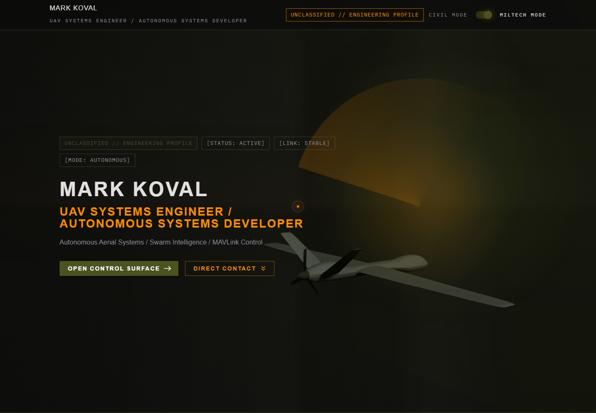
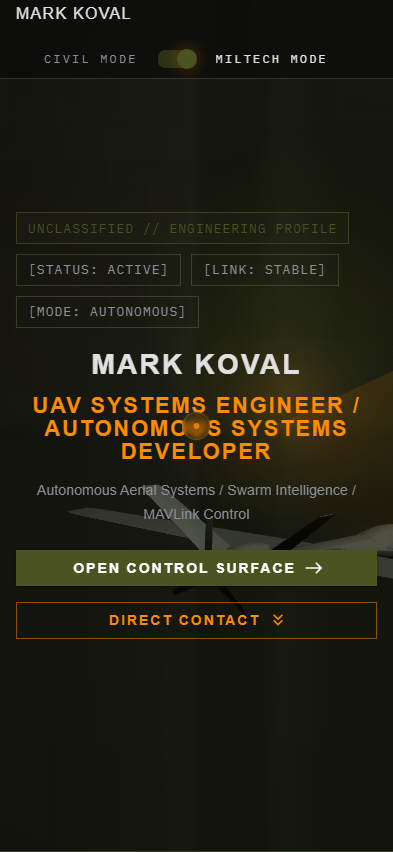

# Mark Koval Miltech Portfolio

<div align="center">


<p>
  
  
  
</p>

<p>
  <a href="mailto:marekmark22@gmail.com"></a>
  <a href="https://t.me/kovalmarkk"></a>
  <a href="https://github.com/MarkKoval"></a>
</p>

<p>
  
  
</p>

</div>

Minimal tactical portfolio / resume web app for a UAV systems engineer. Built with Vite, React, Material UI, Framer Motion, and a Three.js background scene rendered through `@react-three/fiber`.

## Overview

This project presents a military-style engineering profile with:

- dark miltech visual language
- fixed 3D UAV background model
- scroll and mouse reactive scene behavior
- fake ground-control mission UI
- responsive section-based portfolio layout
- toggle between `MILTECH MODE` and `CIVIL MODE`
- loading screen, grid overlays, scan effects, and custom cursor

The app is optimized for a desktop-first presentation but remains usable on tablets and mobile screens.

## Quick Visuals

<p align="center">
  
  
</p>

## Stack

<div align="center">
  
</div>

<p align="center">
  
  
  
  
  
</p>

- Vite
- React 18
- Material UI 5
- Framer Motion
- Three.js
- `@react-three/fiber`
- `@react-three/drei`

## Main Features

### 1. Hero Surface

- engineering classification tags
- tactical headline layout
- call-to-action links
- background UAV model integrated into the hero field

### 2. Profile / Experience Sections

- summary block
- core capabilities
- hardware / software / tools stack
- selected UAV project panels
- operational experience and distinguishing factors

### 3. Fake Mission Control

`Mission Control` is a simulated ground-control section designed to resemble a UAV operator interface.

Included modules:

- Telemetry Panel
- Map Panel
- Swarm Status
- Signal / Link
- Radar / Scanner
- Log Terminal

All panel data is synthetic and updated client-side through timed hooks.

### 4. 3D UAV Background

The 3D layer is rendered behind the UI and uses:

- a GLB model loaded from `public/models/uav.glb`
- low-light directional and ambient lighting
- scroll-based yaw rotation
- mouse-based yaw / pitch / roll response
- constant idle spin
- desktop-biased positioning for the right-side composition

### 5. Interaction Layer

- custom circular cursor for fine pointers
- smooth section reveal animations
- mode toggle for `CIVIL MODE` and `MILTECH MODE`
- email draft form that opens the user’s mail client with prefilled content

## Interface Snapshot

```text
[STATUS: ACTIVE]
[LINK: STABLE]
[MODE: AUTONOMOUS]

SECTIONS:
- Hero
- Summary
- Core Capabilities / Tech Stack
- Selected Projects
- Mission Control
- Experience
- Contact Link
```

## Screenshots

### Hero


### Full Page


### Contact


### Mobile


## Project Structure

```text
src/
  App.jsx
  main.jsx
  data/
    portfolio.js
  theme/
    createAppTheme.js
  styles/
    index.css
  hooks/
    useMissionControlData.js
    useMouseRotation.js
    useScrollRotation.js
  components/
    common/
      AnimatedSection.jsx
      CustomCursor.jsx
      HudPanel.jsx
      LoadingScreen.jsx
      ModeSwitch.jsx
      SectionShell.jsx
    three/
      UAVModel.jsx
      UAVScene.jsx
  sections/
    AboutSection.jsx
    ContactSection.jsx
    ExperienceSection.jsx
    HeroSection.jsx
    MissionControlSection.jsx
    ProjectsSection.jsx
    SkillsSection.jsx
public/
  models/
    uav.glb
docs/
  screenshots/
```

## How It Works

### Data Layer

Static content is stored in `src/data/portfolio.js`.

This includes:

- hero content
- summary lines
- skill groups
- projects
- mission control copy
- experience content
- contact items

### Theme Layer

`src/theme/createAppTheme.js` defines:

- dark palette values
- typography scale
- button, switch, chip, and global baseline overrides
- two visual modes: miltech and civil

### UI Composition

`src/App.jsx` orchestrates:

- boot screen
- theme provider
- background 3D scene
- fixed header
- all resume sections
- footer controls

### 3D Scene

`src/components/three/UAVScene.jsx`:

- mounts the transparent fixed canvas
- applies lights and fog
- places the UAV rig
- combines mouse, scroll, and idle motion

`src/components/three/UAVModel.jsx`:

- loads the GLB model
- normalizes scale
- centers the model by bounding box
- applies fallback procedural geometry if model loading fails

### Simulated Mission Data

`src/hooks/useMissionControlData.js` generates:

- telemetry values
- map trail movement
- swarm status updates
- signal bar changes
- radar blips
- terminal logs

## Getting Started

### Prerequisites

- Node.js 18+ recommended
- npm

### Install

```bash
npm install
```

### Run Development Server

```bash
npm run dev
```

### Create Production Build

```bash
npm run build
```

### Preview Production Build

```bash
npm run preview
```

## Customization Guide

### Update Portfolio Content

Edit:

- `src/data/portfolio.js`

### Replace the UAV Model

Put a `.glb` or `.gltf` model in:

- `public/models/`

Then point `uavAssetPath` in `src/App.jsx` to the file.

### Adjust 3D Scene Placement

Edit:

- `src/components/three/UAVScene.jsx`

Useful values:

- desktop / mobile scene position
- scene scale
- scroll rotation strength
- mouse rotation strength
- idle spin speed

### Adjust Visual Style

Edit:

- `src/theme/createAppTheme.js`
- `src/styles/index.css`

These files control:

- palette
- typography
- cursor visuals
- overlays
- grid density
- radar / map styling
- animation accents

## Known Notes

- the Three.js scene is lazy-loaded, but its chunk is still large during production build
- mission control data is simulated for presentation purposes
- the custom cursor is desktop-only because coarse pointers disable it automatically

## Build Status

Validated with:

```bash
npm run build
```

At the time of the latest check, the production build completed successfully.

## Extras

<div align="center">
  
  
</div>

<div align="center">
  
</div>


<details>
  <summary><b>Contact</b></summary>

- Email: `marekmark22@gmail.com`
- Telegram: `@kovalmarkk`
- GitHub: [github.com/MarkKoval](https://github.com/MarkKoval)
- Location: `Lviv, Ukraine`

</details>
